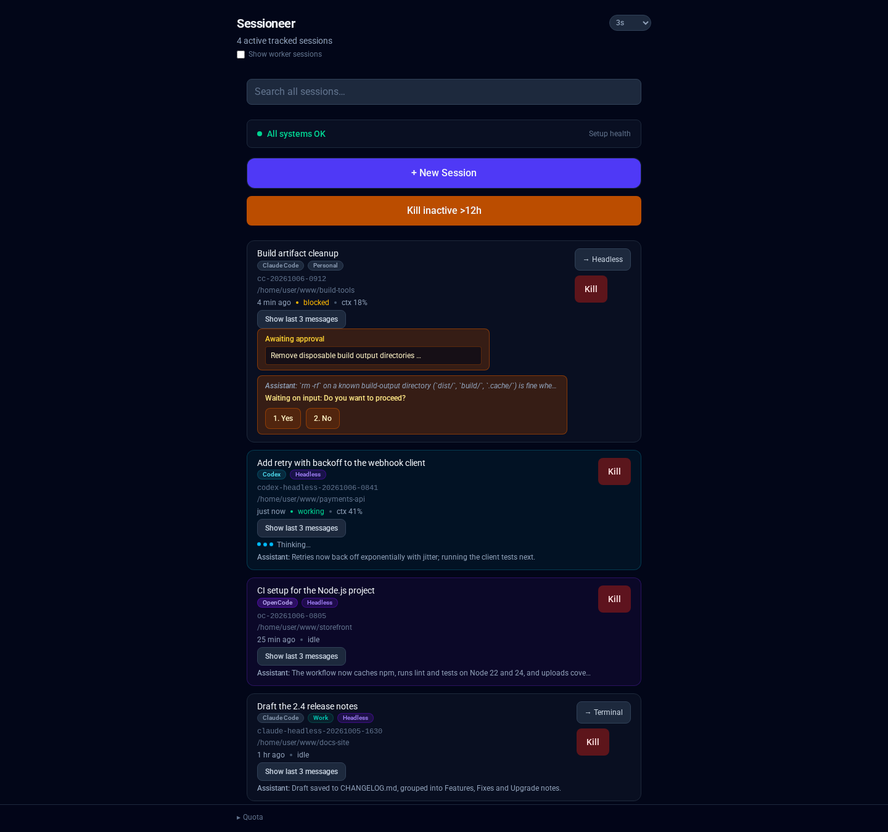
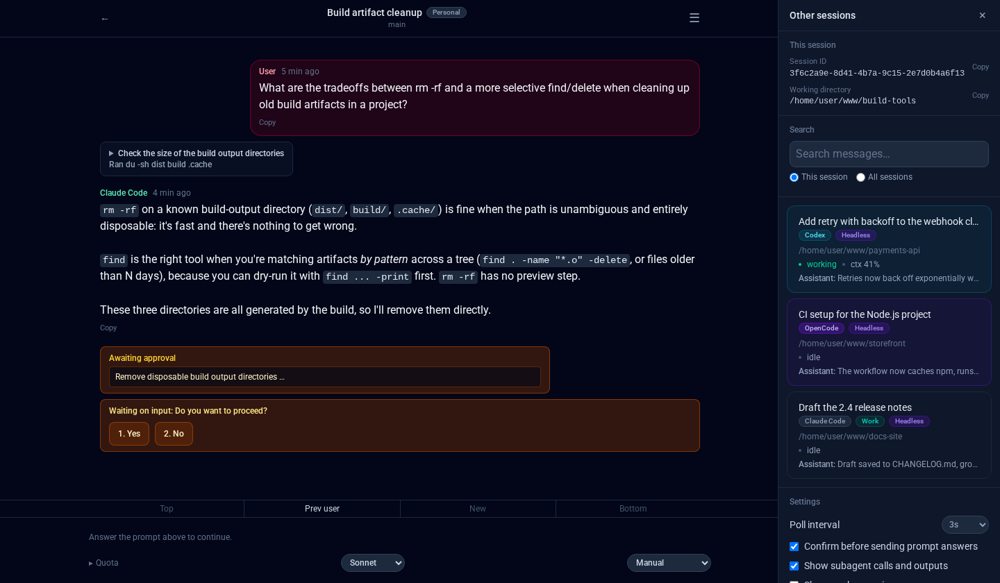
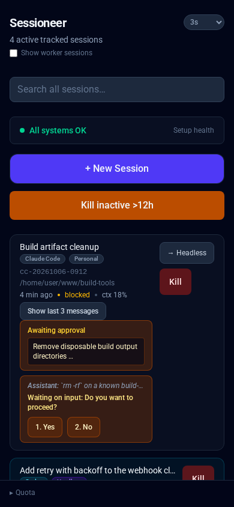
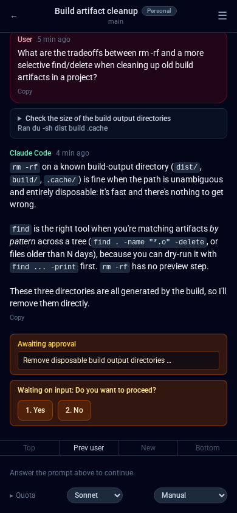

# Sessioneer

[](https://github.com/loki495/sessioneer/actions/workflows/ci.yml)

A self-hosted, LAN-only web UI for managing coding-agent sessions - Claude
Code and Antigravity (`cc-*`/`ag-*`, tmux-driven), OpenCode (native `ses_*`
IDs through its headless server by default, `oc-*` tmux as a fallback), and
Codex (native thread UUIDs, headless only, no tmux at all) - on your own dev
box. See blocked prompts, answer
them, send messages, view transcripts, and kill sessions, all from a phone
or any browser on your network. No accounts, no login - see "Network
binding" below for how access is actually controlled.

> **Note on scope**: this project's primary author runs it as a personal
> tool on their own machine, so day-to-day development is driven by that
> use case. It's shared here as a working example and a starting point for
> your own setup, not as a polished, actively-triaged public product -
> issues and PRs are welcome (see [CONTRIBUTING.md](CONTRIBUTING.md)), but
> treat it as "read the code, adapt it" rather than "install and forget."

## Screenshots



The dashboard lists tracked Claude Code, Codex, OpenCode, and Antigravity
sessions currently running on your box, using tmux names or each headless
agent's native session ID as appropriate.

A session waiting on a tool-permission approval, with real Approve/Deny
buttons right in the browser:



The dashboard and a blocked prompt, on a phone-sized viewport (this app is
an installable PWA, meant to be added to an iOS/Android home screen):




## What it does

> For the exhaustive capability list and the per-agent coverage matrix
> (which agents support which feature, and where parity is partial), see
> [`docs/features.md`](docs/features.md).

- **Session list**: name/title, working directory, relative last-active
  time, attached/detached (tmux-backed sessions), live context-usage
  percentage, and flow state (`idle` / `working` / `blocked`).
- **Blocked-on-input warning**: if a session needs a human decision (folder
  trust on first launch in a new directory, a tool-permission approval, a
  user input prompt), it shows in the UI with a count and link to jump
  directly to the blocked session.
- **Approve/deny tool permissions**: tool-use requires explicit approval in
  some agents (Claude Code, Antigravity); Sessioneer shows the blocked
  prompt in full (command, arguments, what's being written) and lets you
  approve or deny without touching the terminal.
- **Answer `AskUserQuestion` / `UserPrompt` prompts**: some agents ask
  follow-up questions during a run (`"which one: A or B?"`); Sessioneer
  shows them and collects answers.
- **Kill sessions**: stop a running session without killing the whole
  terminal/tmux.
- **View transcripts**: read the full conversation history for a session,
  including all tool calls and results.
- **Mobile-first PWA**: responsive design, works as an installed home-screen
  icon on iOS/Android, with Web Push notifications for blocked/stopped
  sessions (see "Web Push notifications" below).

## Network binding (read this)

There is **no login** - the network binding *is* the access control. This
app is intentionally **not** meant to be reachable from the public
internet - it can create and kill agent sessions on your machine.

- `docker-compose.yml` publishes the port as
  `"${BIND_ADDR}:${APP_PORT}:80"`. Set `BIND_ADDR` in `.env` to your
  machine's actual **LAN IP** (e.g. `192.168.1.50`), never `0.0.0.0`. Leave
  it at the default `127.0.0.1` if you only want to reach it from the host
  itself (e.g. via an SSH tunnel).
- If you put a reverse proxy in front of it, make sure **that proxy** is
  also LAN-only - it's easy to have this app's own bind address correctly
  restricted while an existing shared reverse proxy in front of it is
  bound more broadly, silently exposing this app anyway.
- Consider a host firewall rule (`iptables`/`ufw`/`nftables`) restricting
  inbound `APP_PORT` to your LAN subnet as defense in depth.

## Architecture

For technical details on the container/host-agent split and major implementation decisions, see [`docs/architecture.md`](docs/architecture.md).

## Agent-specific setup and behavior

The common install above is enough to run the UI, but each agent obtains
identity, status, transcripts, prompts, and writes differently. These details
matter when diagnosing an idle-looking session or a prompt that cannot be
answered in Sessioneer.

| Agent | Runtime | Status / prompts | Extra setup |
|---|---|---|---|
| Claude Code | tmux only | Claude hooks, with narrow pane fallbacks for folder trust and `AskUserQuestion` UI state | Click **Install hooks** |
| Antigravity | tmux only | Hooks provide lifecycle and conversation identity; the live pane identifies approval dialogs | Install its global hooks; optionally enable its quota timer |
| OpenCode | `opencode serve` by default; tmux fallback | Serve API + SQLite + global permissions plugin; tmux permissions also consult the live pane | Re-run `host-agent/install.sh` after setting `OPENCODE_BIN` |
| Codex | headless only | Private app-server bridge for locally-owned startup; persistent queue + Codex hooks for shared/Remote-owned threads | Click **Install hooks**, trust them in Codex, and bootstrap Remote control when sharing with Codex Remote |

### Claude Code

Sessioneer starts `cc-*` sessions in tmux. Five hooks in
`~/.claude/settings.json` (`SessionStart`, `PreToolUse`,
`PermissionRequest`, `UserPromptSubmit`, and `Stop`) maintain transcript
identity, flow state, permission details, mode, and the last response. The
installer merges only Sessioneer's entries and refuses to overwrite malformed
JSON. Already-running Claude sessions may need to be resumed or restarted
before newly-installed hooks take effect.

Permission approvals, free-text questions, multi-question
`AskUserQuestion`, message sending, escape, model/mode switching, and manual
`tmux attach` remain available. Folder trust and the currently-visible tab of
an `AskUserQuestion` are the deliberate pane-based exceptions because Claude's
hook payload does not contain enough UI state. Bare-process discovery and
**Take over** are currently Claude-only.

Claude quota data is captured when a tmux session renders its configured status
line and, for headless sessions, from the rate-limit events the manager sees; it
can show unavailable until either has run once.

**Multiple accounts:** to run sessions under more than one Claude account
(e.g. a separate work login), add named profiles to
`host-agent/config/agents.php`, each with its own `config_dir` (the account's
`CLAUDE_CONFIG_DIR`) and optionally its own `bin`. Once configured, the New
Session form shows an Account selector; each configured account's hooks and
status-line quota capture need installing into that account's own
`CLAUDE_CONFIG_DIR`/`settings.json` the same way as the default account
above. A session's account is shown as a small badge on its row, header, and
archived view, and the quota footer shows one row per configured account.

### Antigravity

Sessioneer starts `ag-*` sessions in tmux. Install the four global hooks
(`PreToolUse`, `PostToolUse`, `PreInvocation`, and `Stop`) from the repository
root with:

```bash
php -r 'require "vendor/autoload.php"; print_r(\HostAgent\Services\AntigravityHookService::install_session_hook());'
```

They are merged under the `sessioneer` group in
`~/.gemini/config/hooks.json`, leaving other groups untouched. Because this is
a global Antigravity configuration, the hooks fire for every `agy` process;
the scripts use `SESSIONEER_SESSION_NAME` to make non-Sessioneer sessions a
no-op. Reopen existing sessions after installing or changing them.

The hooks provide working/idle state, tool metadata, and reactive binding to
Antigravity's real conversation ID. Antigravity does not expose an authoritative
"approval is currently visible" event, so Sessioneer confirms and answers the
actual approval dialog through the tmux pane. Model switching changes
Antigravity's account-wide default, not only the current session. The optional
quota poller is installed but disabled by default:

```bash
systemctl --user enable --now sessioneer-antigravity-quota-check.timer
```

### OpenCode

With `OPENCODE_BIN` configured, `host-agent/install.sh` installs and enables
`opencode-serve.service` and `sessioneer-opencode-events.service`, and copies
`host-agent/opencode-plugins/sessioneer-permissions.js` to
`~/.config/opencode/plugins/`. Restart the server and any already-running TUI
sessions after installing or updating the plugin:

```bash
systemctl --user restart opencode-serve.service
```

Headless sessions are the preferred path: Sessioneer talks directly to the
serve API for lifecycle, messages, questions, and permissions. The tmux TUI is
retained as a fallback. OpenCode creates its `ses_*` ID only after the first
prompt; Sessioneer binds it reactively from `opencode.db`. The permissions
plugin records `permission.asked` events because the tested OpenCode version
does not expose reliable persistent permission state through its HTTP API.
The dashboard health section checks both the service and plugin file.

The events service listens to each tracked headless session's exact OpenCode
directory and records question prompts for Sessioneer's existing answer forms.
It reconnects independently of page visits; normal status polling preserves
pending event-fed questions. Question replies use their server request ID,
with a scoped legacy fallback where the v2 reply endpoint is unavailable.
Check the consumer with `systemctl --user status sessioneer-opencode-events.service`
and `journalctl --user -u sessioneer-opencode-events.service`.

OpenCode supports model selection but not Sessioneer's Claude-style
manual/accept-edits/plan mode vocabulary. Its quota display combines local
SQLite usage with the OpenCode Go usage endpoint when configured.

### Codex: shared threads and ownership

For detailed agent version compatibility and known quirks, see [`docs/agent-compatibility.md`](docs/agent-compatibility.md).


Sessioneer never puts Codex in tmux. `host-agent/install.sh` installs and
enables `sessioneer-codex-bridge.service`, which owns a private, persistent
`codex app-server --stdio` connection for thread creation, the first turn of
an unmaterialized thread, bridge-owned prompt responses, model/effort settings,
and lifecycle operations.
Check or restart it with:

```bash
systemctl --user status sessioneer-codex-bridge.service
systemctl --user restart sessioneer-codex-bridge.service
```

For a thread that already has a persisted rollout, the compose box sends via
Codex's persistent `codex queue --thread ... --message ...` path. That makes a
thread writable from Sessioneer even when Codex Remote started it or currently
has it loaded. Queue writes are FIFO and deferred while a turn is active; they
do not steal the active turn or its prompt ownership. The first message of a
brand-new, not-yet-materialized Sessioneer thread is the one exception and is
sent through the private bridge that created it.

To share threads with Codex Remote, its managed daemon must be running with
remote control enabled:

```bash
codex app-server daemon bootstrap --remote-control
codex app-server daemon version
```

Use the absolute `CODEX_BIN` path here if `codex` is not on your shell's
`PATH`.

Rebootstrapping the managed daemon does not delete persisted Codex sessions,
so they remain resumable, but it can interrupt an active turn. Restarting the
private Sessioneer bridge likewise clears any stale bridge-owned pending prompt
because its response ID died with the old connection.

The **Install hooks** button adds Sessioneer's observer to
`~/.codex/hooks.json` for `SessionStart`, `UserPromptSubmit`,
`PreToolUse(request_user_input)`, `PermissionRequest`, `PostToolUse`, `Stop`,
`Interrupt`, and `SessionEnd`. These hooks are intentionally passive: they
only update Sessioneer's status database and always return a neutral response.
Codex requires new or changed non-managed hooks to be reviewed and trusted in
`/hooks`; changing a hook definition changes its trust hash. Reopen or resume
sessions that were already open when the hook configuration changed. See the
[official Codex hooks documentation](https://developers.openai.com/codex/hooks).

An approval or `request_user_input` prompt belongs to the app-server
connection that created it. Therefore Sessioneer can answer a prompt only when
its private bridge owns the active turn (notably the first turn described
above). A prompt from Codex Remote or from the shared queue/managed transport
is observability-only in Sessioneer: it shows the session as blocked, preserves
useful prompt context, removes answer buttons, and directs you to Codex Remote.
The persistent queue solves cross-owner **messages**, not cross-owner **prompt
responses**.

**Deploying behind a real web server instead of `php -S`**: point its
document root at `public/`, nothing else. Apache: enable `mod_rewrite` and
use `public/.htaccess` as-is. nginx: add the equivalent of
```nginx
location / {
    try_files $uri $uri/ /index.php?$query_string;
}
```


## Home screen bookmark
## Web Push notifications

Lets a session's newly-blocked prompt reach your phone without the tab
open and polling. Off by default on a fresh checkout (no VAPID keys, no
timer running) - every piece is a harmless no-op until you opt in.

0. **Requires HTTPS - a hard platform requirement, not optional.** Service
   Workers (what Web Push is built on) are blocked entirely by the browser
   outside a secure context - plain `http://` never works for this
   specifically, silently (no error, the "Enable notifications" button
   just never appears). You need some way to serve this app over HTTPS
   with a certificate your phone trusts - a reverse proxy (Traefik, Caddy,
   nginx) with either a real certificate (Let's Encrypt, if this is
   reachable enough for that - unlikely for a LAN-only app) or a
   self-signed one you manually trust on your device works.

   If you go the self-signed route on iOS specifically: a "proceed
   anyway" click through Safari's own warning page does **not** carry over
   to a home-screen-installed app's separate WebView context - you need to
   actually install the certificate as a trusted profile (AirDrop/email
   yourself the `.crt`, not the `.key`; Settings will offer "Install
   Profile"; then separately enable full trust for it under Settings →
   General → About → Certificate Trust Settings). Keep the cert's validity
   under 398 days if you want it to be trustable via iOS's Certificate
   Trust Settings at all - Apple caps it there, and a longer-lived cert
   will silently never be trustable that way.

1. **Generate a VAPID keypair** (one-time, on the host):
   ```
   php -r "require 'vendor/autoload.php'; print_r(Minishlink\WebPush\VAPID::createVapidKeys());"
   ```
2. Put the two resulting keys, plus a contact address, in `host-agent/.env`:
   ```
   VAPID_PUBLIC_KEY=...
   VAPID_PRIVATE_KEY=...
   VAPID_SUBJECT=mailto:you@example.com
   ```
3. Reload the page in the browser you want notifications on and tap
   "Enable notifications" (only appears once the keys above are set).
   Requires the site to already be added to the home screen first - iOS
   Safari only exposes the Push API to a home-screen-launched PWA, not a
   regular browser tab.
4. Enable the timer that actually checks for newly-blocked sessions and
   sends the pushes (installed but left disabled by `install.sh`, since
   starting a new recurring background service deserves a deliberate
   opt-in):
   ```
   systemctl --user enable --now sessioneer-push-check.timer
   ```

**iOS's subscription lifecycle is flaky, by design of the platform, not a
bug here**: a subscription can silently die after roughly 1-2 weeks. The
frontend's own mitigation: every page load with an existing subscription
silently re-POSTs it to stay fresh, so simply opening the app periodically
self-heals a subscription that's started to go stale.

See [CONTRIBUTING.md](CONTRIBUTING.md) for the full push-delivery
mechanism, notification-content details, and the quota-push variant.

# Current limitations


- No accounts, no multi-user support — this is a single-operator tool for one person's
  own dev box, gated by network binding, not a login (see "Network binding" above).
- Only manages sessions on the same host the container and host agent run on — no
  remote/multi-host session management.
- Feature parity across agents (Claude Code, Antigravity, OpenCode, Codex) is partial —
  see [`docs/features.md`](docs/features.md) for the exact per-agent coverage matrix.
- Content search currently covers Claude Code and OpenCode; bare/untracked-process
  discovery is Claude Code only.
- Web Push on iOS is inherently flaky (a platform limitation, not a bug here) — a
  subscription can silently die after 1-2 weeks; see "Web Push notifications" above.
- Browser coverage exercises the main rendered interactions, but live calls to
  third-party agent services still require explicit local verification.

## Contributing

See [CONTRIBUTING.md](CONTRIBUTING.md) for the architecture deep-dive, file
structure, hook rationale, development workflow, and testing details.

## License
